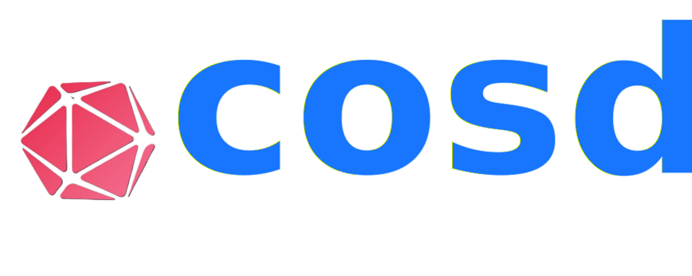

<p align="center">
  
</p>


<p align="center">
    <b>The future ready AI data platform to power the next generation search pipelines.</b>    
</p>
<p align="center">
  <a href="https://github.com/cosdata/cosdata/actions"></a>
  <a href="https://github.com/cosdata/cosdata/blob/master/LICENSE"></a>
  <a href="https://www.rust-lang.org/"></a>
  <a href="https://discord.gg/WbSbXYWvta"></a>
</p>
</br>
<p></p>

**Cosdata**: A cutting-edge AI data platform engineered for exceptional performance. Featuring immutability and version control, it's designed to elevate a wide range of AI and machine learning projects.

Cosdata is at the forefront of advancing search technology, excelling in critical areas that will define the next generation of search pipelines:
- **Semantic Search**: Leverage embedding-based hybrid search, seamlessly managing both dense and sparse vectors to deliver deep semantic analysis.
- **Structured Knowledge Graphs**: Sophisticated context retrieval by leveraging structured knowledge graphs.
- **Hybrid Search Capabilities**: Combine explicit relationship queries with vector similarity search.
- **Real-Time Search at Scale**: Execute real-time vector search with unmatched scalability, ensuring that your search pipeline performs flawlessly under any load.
- **ML Pipeline Integration**: Enjoy seamless integration with your existing machine learning pipeline, enhancing your search capabilities without disrupting your workflow.

Cosdata is designed to meet the demands of modern search applications, empowering businesses to harness the full potential of their data.

<p align="center">
<strong><a href="#features">Features</a> • <a href="#getting-started">Getting Started</a> • <a href="org/docs_index.md">Docs</a> • <a href="#contacts">Contact Us</a> • <a href="#show-your-support">Show Your Support</a>
</strong>
</p>

## Features

### Search Relevance
- **Hybrid Search**: Enhance search precision with our vector database, leveraging the power of combined sparse and dense vector searches to deliver highly relevant, context-rich results for complex queries.
- **Knowledge-Graph**: Improve the relevance of your search results by seamlessly combining structured information from knowledge graphs with the nuanced semantics of vector embedding, enabling our vector database to deliver richer and more relevant insights.
  
### High performance
- **Indexing**: Experience lightning-fast indexing with our vector database, optimized for handling high-dimensional data at scale. Our advanced indexing algorithms ensure that your sparse and dense vectors are always ready for instant querying, no matter how large or complex your dataset grows.
- **Latency**: Power your applications with lightning-fast search performance—our vector database is engineered to deliver exceptionally fast query responses.
- **Requests per second**: Achieve industry-leading concurrent requests per second (RPS) across different indices with an advanced architecture designed for optimal performance under heavy loads.
  
### Customizable
- **Configurability**: Gain precise control over your setup with manual configuration of all indexing and querying hyperparameters, enabling you to optimize performance, resource utilization and tailor results to your exact specifications. 
- **Dense Vector indexing**: Achieve efficient and precise indexing with our vector database’s optimized HNSW (Hierarchical Navigable Small World) algorithm, designed to enhance search performance and accuracy for large-scale data sets.
- **Sparse vectors**: Expertly designed to work seamlessly with SPLADE-generated sparse vectors, our solution offers superior performance compared to BM25 indices for more precise and meaningful insights.
  
### Scalability
- Unlock unbounded scalability with our vector database, engineered to grow alongside your data and query demands. Whether you're handling millions of records or scaling up to massive datasets, enjoy consistent, high-speed performance without compromise 
- Achieve predictable and efficient query performance with our vector database, engineered for near-linear scalability that ensures fast results, even as your data expands.
  
### Efficient
- **Resource utilization**: Efficiency is at the core of our vector database, where ingenious provably efficient data structures and algorithms ensure outstanding performance while providing increasingly relevant search results.
- **Scalar quantization**: Configure finer quantization resolutions, including quarter-nary (2-bit) and octal (3-bit), for enhanced compression and improved recall trade-offs, giving you more control over data efficiency and performance.
- **Product quantization**: A pioneering product quantization approach to not only compress data more effectively but also enhance recall performance beyond what scalar quantization offers, optimizing both data efficiency and retrieval recall.
  
### Enterprise-grade
- **Data isolation**: Experience enterprise-grade privacy with our vector database, providing robust data isolation to ensure secure and consistent access.
- **Data security**: Achieve reliable data security with our vector database, designed with robust safeguards such as role-based-access-control to protect your information and maintain its integrity against unauthorized access and threats.
- **Multiple deployment modes**: Deploy our vector database in various environments—whether at the edge, in a private cloud, public cloud, or serverless setup—providing you with flexible, scalable solutions to meet your unique operational needs.
- **Reliability**: Cosdata delivers reliable performance and data integrity with fault-tolerance, backup, and recovery features, designed to meet enterprise demands and ensure uninterrupted operation.
- **Versioning**: Experience Git-like version control with our vector database, enabling you to compare search performance, use time travel to access past states, audit data, and effortlessly roll back when necessary.

### Easy to use
- **Auto-configuration of hyper-parameters**: Achieve peak performance with our vector database, utilizing insights-driven auto-configuration of hyperparameters to automatically fine-tune your system for the best results, no manual adjustments needed. 
- **Intuitive API**: Elegantly crafted HTTP Restful APIs featuring _"Transactions as a resource"_. Manage all functions of our vector database effortlessly with intuitive HTTP RESTful APIs.
- **Client SDKs in your favourite language**: Access our vector database effortlessly with client SDKs available in multiple programming languages.
- **Powerful and expressive cosQuery language**: Leverage cosQuery, a powerful and expressive declarative query language, to seamlessly query data across vector embedding and knowledge graph, enabling deep and nuanced insights into your data.

### Manage Multi-modal data
- Supports real-time querying and dynamic index updates, ensuring that new multi-modal data (text, images, audio, etc.) is immediately searchable without downtime or delays.


## Getting Started

This guide provides step-by-step instructions for installing Cosdata on Linux systems.

### Prerequisites

Before installing Cosdata, ensure you have the following:

- Git
- Rust (latest stable version)
- Cargo (Rust's package manager)
- A C++ compiler (GCC 4.8+ or Clang 3.4+)
- CMake (3.10+)

### Installation Steps

#### Building Cosdata

Clone the Cosdata repository:

```
git clone https://github.com/cosdata/cosdata.git
cd cosdata
```

Build the project:

```
cargo build --release
```

### Self Signed Certificates

It's recommended to run Cosdata server in HTTPS mode i.e. with TLS
support. However, during development it might be easier to get it
running without TLS. To do so, set `server.mode=http` in the
[config.toml](config.toml) file.

Alternately, you may use self-signed certificates for testing the
APIs. The paths to the certificate and private key files are
configured in the [config.toml](config.toml) file.

This sections mentions how you can generate and setup the
certificates.

#### Generate Certificates

Run the following commands in sequence to get the private key and certificate

```bash
openssl req -newkey rsa:2048 -nodes -keyout private_key.pem -x509 -days 365 -out self_signed_certificate.crt

# Convert the private key to PKCS#8 format
openssl pkcs8 -topk8 -inform PEM -outform PEM -in private_key.pem -out private_key_pkcs8.pem -nocrypt
```

#### Setup Certificates

Set the `SSL_CERT_DIR` environment variable to the folder where you're gonna store the certificates:

```bash
export SSL_CERT_DIR="/etc/ssl"
```

Move certificates to appropriate folders and set permissions:

```bash
# Create directories if don't exist
sudo mkdir -p $SSL_CERT_DIR/{certs,private}

# Move certificates
sudo mv self_signed_certificate.crt $SSL_CERT_DIR/certs/cosdata-ssl.crt
sudo mv private_key_pkcs8.pem $SSL_CERT_DIR/private/cosdata-ssl.key

# Create 'ssl-cert' group (if if doesn't exist already)
sudo groupadd ssl-cert

# Change private key file permissions
sudo chgrp ssl-cert $SSL_CERT_DIR/private/cosdata-ssl.key
sudo chmod 640 $SSL_CERT_DIR/private/cosdata-ssl.key
sudo usermod -aG ssl-cert $USER

# Change private key folder permissions
sudo chmod 750 $SSL_CERT_DIR/private
sudo chgrp ssl-cert $SSL_CERT_DIR/private

# Add yourself to ssl-cert group (you may need to re-login after this)
newgrp ssl-cert
```

## Contacts

- Want to learn more and/or contribute to the project? Join our [Discord channel](https://discord.gg/WbSbXYWvta)
- For business inquiries, please reach us at [contact@cosdata.io](mailto:contact@cosdata.io)

## Show Your Support

⭐️ If you find this project useful, please give it a star on GitHub! ⭐️

Your support helps us improve and continue developing. Thank you!

